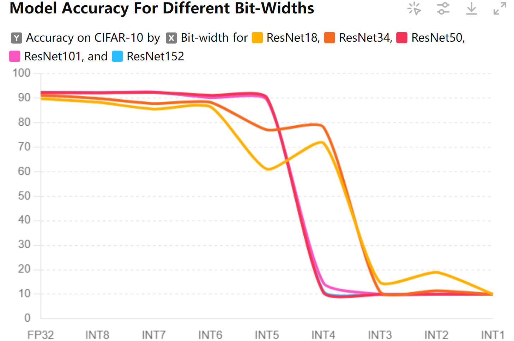

---
author:
- 戚一嘉豪 2200012732
bibliography:
- references.bib
date: 2024-10-04
title: 应用物理实践探究3
---

# Experiment Part {#experiment-part .unnumbered}

# Hand-on Quantization on MNIST[@MNIST]

## Methodology

We use S and Z to represent scale and zero point, r to represent
floating-point real numbers, and q to represent fixed-point integers.

Assume the weights of the convolution are $w$, the bias is $b$, the
input is $x$, and the output activation value is $a$. Since convolution
is essentially a matrix operation, it can be expressed as:

$$a = \sum_{i=1}^{N} w_i x_i + b$$

From this, we get the quantization formula:

$$S_a (q_a - Z_a) = \sum_{i=1}^{N} S_w (q_w - Z_w) S_x (q_x - Z_x) + S_b (q_b - Z_b)$$

By rearranging, we obtain:

$$q_a = \frac{S_w S_x}{S_a} \sum_{i=1}^{N} (q_w - Z_w) (q_x - Z_x) + \frac{S_b}{S_a} (q_b - Z_b) + Z_a$$

$$\begin{aligned}
q_a &= \frac{S_w S_x}{S_a} \left( \sum_{i=1}^{N} (q_w - Z_w)(q_x - Z_x) + q_b \right) + Z_a \\
&= M \left( \sum_{i=1}^{N} q_w q_x - \sum_{i=1}^{N} q_w Z_x - \sum_{i=1}^{N} q_x Z_w + \sum_{i=1}^{N} Z_w Z_x + q_b \right) + Z_a
\end{aligned}$$

We first use the simplest quantization method--Post Training
Quantization(PTQ), that is, after calculating the min and max, according
to the linear quantization formula:

$$S = \frac{r_{\max} - r_{\min}}{q_{\max} - q_{\min}}$$

$$Z = \text{round}\left(q_{\max} - \frac{r_{\max}}{S}\right)$$

to calculate the scale and zero point.

After training the full-precision floating-point 32 model (FP32), we
first run some data through the regular forward process. During this
process, we determine the approximate minimum and maximum values of the
input, output, and feature map for this dataset. These values can then
be used to represent the scale and zero point for the entire dataset.

{width="100%"}

During inference, we first quantize the input $x$ into integer $q_x$,
then use formula (4) to calculate the quantized convolution output
$q_{a1}$, resulting in an integer, and we continue to calculate the
output $q_{a2}$ of the ReLU. For fc layers, it is also a matrix
operation, so we can use formula (4) to calculate and then obtain $q_y$.
Finally, based on the scale and zero point calculated by each layer, we
derive the floating-point result. Apart from the quantization and
dequantization of the input and output, other processes can be completed
by fixed-point operations.

## Experiment1: Post-training Quantization(PTQ)

Source code can be found at [here](#ptq for MNIST).

First, we train a full precision model for PTQ use.

{width="75%"} []{#MNIST training
label="MNIST training"}

We can see that the final accuracy of this model on MNIST is around 99%,
with the weights accounting for 43KB. Then, we can load this
full-precision model and quantize the model's weights into INT8, INT7,
\..., INT1 for smaller storage overhead and faster inference.

   **Weight Bit-width (bits)**   **Total Size (KB)**   Accuracy
  ----------------------------- --------------------- ----------
              FP32                      43.63           98.86%
              INT8                      10.91           98.87%
              INT7                      9.54            98.83%
              INT6                      8.18            98.78%
              INT5                      6.83            98.69%
              INT4                      5.47            97.89%
              INT3                      4.11            94.58%
              INT2                      2.76            15.45%
              INT1                       1.4            9.80%

  : Model Size for Different Quantization Bit-widths

{width="75%"}

We can see the accuracy hardly falls even though weight is quantized
into INT4, INT3, which only takes up $\frac{1}{8}$ storage space of
FP32. However, when bit-width decreases to INT2 and INT1, the accuracy
drops quickly, appearing like randomly guessing, for MNIST have only 10
classes for recognition(digit from $0 \sim 9$). So we can choose INT4
for practical deployment which balance accuracy and storage overhead.

## Experiment2: Quantization-Aware Training(QAT)

Source code can be seen [here](#qat for MNIST).

QAT can maintain accuracy by simulating quantization effects during
training, unlike PTQ which is unable to see training data to compensate
for quantization accuracy loss. However, applying the round(x) function
during training results in zero gradients due to its flat curve except
at discontinuities. The Straight Through Estimator (STE)[@Bengio2013STE]
addresses this by bypassing the quantization and rounding process. It
passes gradients from the convolutional layer directly back to the
weights before quantization, ensuring the network continues training
normally.

{width="75%"}

   **Quantization Bit-width**   **QAT Accuracy (%)**   **PTQ Accuracy (%)**
  ---------------------------- ---------------------- ----------------------
               32                      98.86                  98.86
               8                       99.09                  98.87
               7                       99.09                  98.83
               6                       98.99                  98.78
               5                       98.89                  98.69
               4                       98.23                  97.89
               3                       95.70                  94.55
               2                       37.24                  15.45
               1                        9.80                   9.80

  : Comparison of QAT vs PTQ Accuracy and Loss

It can be seen that at bit=2 and 3, QAT brings obvious improvement
compared with PTQ.

At bit=1, the gradient returned by quantization training is 0, so the
training fails. This is because at bit=1, the entire network has
degenerated into a binary network. Although we currently use STE to
solve the gradient problem, due to the large information loss caused by
low-bit characteristics in the network, normal training methods are very
difficult to play a role.

# Quantization for ResNet on CIFAR-10(-100)

## Model and Dataset choice

After quantizing a model on MNIST, I realized that MNIST is too simple
for CNN, so the accuracy only drops when the bit-width reaches 3 bits or
less. Additionally, the model size is less than 45KB, making
quantization seem unnecessary. Consequently, I decided to train a more
complex model on a more challenging dataset to better understand the
effects of quantization.

ResNet (Residual Networks) architectures[@He2016ResNet], including
ResNet-18, ResNet-34, ResNet-50, ResNet-101, ResNet-152, are deep
convolutional neural networks known for their residual blocks. ResNet-18
has 18 layers, while ResNet-152 has 152 layers, providing varying levels
of complexity and capacity.

CIFAR-10[@CIFAR10] and CIFAR-100[@CIFAR100] are popular image
classification datasets. CIFAR-10 consists of 60,000 32x32 color images
in 10 classes, with 6,000 images per class. CIFAR-100 is similar but
more challenging, which contains 100 classes with 600 images each.

Initially, I attempted to train ResNet on Tiny-ImageNet[@TinyImageNet],
which includes 200 object classes and is more challenging than
CIFAR-100. The loss gradually decreased and the training process went
well, but the validation accuracy remained under 1%. After thorough
debugging, I found some unconquerable errors in the test set's and
validation set's configuration. Therefore, I decided to switch to
CIFAR-10 and CIFAR-100 to continue my experiments.

## Model Training

We train ResNet-18, ResNet-34, ResNet-50, ResNet-101, ResNet-152 on
CIFAR-10 and CIFAR-100 for 10 epochs. Source code of training on
CIFAR-10 can be found [here](#resnetoncifar10) and CIFAR-100
[here](#resnetoncifar100).

{width="70%"}

{width="100%"}

::: {#tab:model_sizes}
  Model         CIFAR10 (MB)   CIFAR100 (MB)
  ----------- -------------- ---------------
  ResNet18             42.73           42.91
  ResNet34             81.35           81.53
  ResNet50             90.06           90.32
  ResNet101           162.81          163.51
  ResNet152           222.76          223.46

  : Model Sizes for CIFAR-10 and CIFAR-100 Datasets
:::

We can see that all models perform well on CIFAR-10, while larger models
like ResNet152 achieve higher accuracy on CIFAR-100, about 5% higher
than smaller models like ResNet18 but larger models result in obviously
storage overhead, as is seen at [Table3](#tab:model_sizes). This makes
the larger models better candidates to figure out quantization's
influence to accuracy. Another observation is that the accuracy of
larger models fluctuates more during the final training epochs,
indicating that they may suffer from overfitting, which affects their
generalization ability. We plan to use quantization to help mitigate the
overfitting problem in larger models.

## Experiment3: Quantization on Fully-Connected(FC) layers

As we know Fully-Connected layers would take up whole models'
computation to a large extent like $50\sim80\%$. So quantizing FC layers
is extremely important for decreasing CNN's inference latency.

First of all, I quantize FC layers of ResNet models trained on CIFAR-10
from FP32 to INT8, INT7, \...INT1 and test them on CIFAR-10 again to
figure out relationship between bit-width and accuracy loss.(libs from
[@QPyTorchGithub])

{width="75%"}

::: {#tab:accuracy_cifar-10}
     Model     32-bit   8-bit   7-bit   6-bit   5-bit   4-bit   3-bit   2-bit   1-bit
  ----------- -------- ------- ------- ------- ------- ------- ------- ------- -------
   resnet18    89.77    89.55   89.34   89.15   88.77   85.39   78.45   87.63   85.43
   resnet34    91.15    91.15   90.53   90.47   90.51   89.71   84.91   87.14   89.59
   resnet50    92.32    91.99   91.84   92.13   92.14   90.37   87.66   85.96   86.66
   resnet101   92.09    92.14   91.95   91.33   90.83   89.78   88.04   85.44   86.49
   resnet152   92.35    91.9    91.76   92.05   91.26   90.39   90.29   89.42   86.12

  : Accuracy(%) of different ResNet models on CIFAR-10 at various
  bit-widths
:::

We observe that larger models are more resilient to quantization and
suffer less accuracy loss when quantized to lower bit-width.
Interestingly, compared with their original FP32 form, models like
ResNet101 and ResNet150 perform better under 5-bit quantization. This
may be because quantization introduces noise and information loss that
somehow alleviates overfitting. Additionally, low bit-width quantization
doesn't significantly affect accuracy, likely because CIFAR-10 is too
simple for CNN models like ResNet. Therefore, we extended our tests to
CIFAR-100 for a more comprehensive evaluation.

{width="75%"}

::: {#tab:accuracy_cifar-100}
     Model     32-bit   8-bit   7-bit   6-bit   5-bit   4-bit   3-bit   2-bit   1-bit
  ----------- -------- ------- ------- ------- ------- ------- ------- ------- -------
   resnet18    69.61    69.22   66.24   67.23   58.93   59.78   49.76   50.94   39.68
   resnet34    68.36    67.87   64.35   64.94   57.1    58.8    49.13   47.96   32.69
   resnet50    74.35    74.05   70.58   70.55   64.77   65.03   53.07   52.68   39.31
   resnet101   73.54    73.09   71.98   71.29   66.78   66.22   56.85   54.3    43.3
   resnet152   74.46    73.76   72.74   72.73   67.81   68.26   58.72   59.56   46.12

  : Accuracy(%) of different ResNet models on CIFAR-100 at various
  bit-widths
:::

::: {#tab:resnet_fc_layer_sizes_transposed}
  Model         ResNet18   ResNet34   ResNet50   ResNet101   ResNet150
  ----------- ---------- ---------- ---------- ----------- -----------
  FP32 (KB)       200.00     200.00      800.0       800.0       800.0
  INT8 (KB)        50.00      50.00      200.0       200.0       200.0
  INT7 (KB)        43.75      43.75      175.0       175.0       175.0
  INT6 (KB)        37.50      37.50      150.0       150.0       150.0
  INT5 (KB)        31.25      31.25      125.0       125.0       125.0
  INT4 (KB)        25.00      25.00      100.0       100.0       100.0
  INT3 (KB)        18.75      18.75       75.0        75.0        75.0
  INT2 (KB)        12.50      12.50       50.0        50.0        50.0
  INT1 (KB)         6.25       6.25       25.0        25.0        25.0

  : ResNet FC Layer Sizes for different bit-width
:::

As expected, the accuracy of quantized ResNet models on CIFAR-100 drops
quickly as the bit-width decreases. Larger models remain more resilient
than smaller ones. However, quantizing to INT8 has minimal impact on
overall accuracy for CIFAR-100. For example, quantizing ResNet152 to
INT6 results in only a 1.73% accuracy loss while reducing FC layer
weight storage by 81.25%. This means we can significantly decrease
storage overhead with minimal accuracy trade-offs.

## Experiment4: Quantization on Batch-Normalization(BN) layers

BN layers normalize the inputs to each layer, ensuring a mean of zero
and variance of one, which helps stabilize the learning process,
allowing for higher learning rates and faster convergence.

So first of all, I test BN layer quantized model on CIFAR-10.

   **Bit-width**   **ResNet18**   **ResNet34**   **ResNet50**   **ResNet101**   **ResNet152**
  --------------- -------------- -------------- -------------- --------------- ---------------
       FP32           89.77%         91.15%         92.32%         92.09%          92.35%
       INT8           88.32%         89.88%         92.12%         92.16%          92.22%
       INT7           85.49%         87.72%         92.28%         92.47%          92.30%
       INT6           86.42%         88.29%         91.10%         90.18%          90.35%
       INT5           61.03%         77.01%         90.09%         89.29%          90.08%
       INT4           71.66%         78.14%         10.69%         14.62%          11.16%
       INT3           14.85%         11.01%         9.88%          10.08%          10.02%
       INT2           18.93%         11.44%         10.00%         10.00%          10.00%
       INT1           10.00%         10.00%         10.00%         10.00%          10.00%

  : Model Accuracy for Different Bit-widths on CIFAR-10

{width="75%"}

                 ResNet18   ResNet34   ResNet50   ResNet101   ResNet152
  ------------ ---------- ---------- ---------- ----------- -----------
  FP32 (KB)       30.0000   59.00000    236.000     508.000     748.000
  INT8 (KB)        7.5000   14.75000     59.000     127.000     187.000
  7-bit (KB)       6.5625   12.90625     51.625     111.125     163.625
  6-bit (KB)       5.6250   11.06250     44.250      95.250     140.250
  5-bit (KB)       4.6875    9.21875     36.875      79.375     116.875
  4-bit (KB)       3.7500    7.37500     29.500      63.500      93.500
  3-bit (KB)       2.8125    5.53125     22.125      47.625      70.125
  2-bit (KB)       1.8750    3.68750     14.750      31.750      46.750
  1-bit (KB)       0.9375    1.84375      7.375      15.875      23.375

  : BN Layer Sizes(KB) for ResNet Models

The accuracy remains stable even when quantized to INT6, and ResNet152
can withstand INT5 quantization. However, for INT4, smaller models
outperform larger ones. This may be because CIFAR-10 is too easy for
ResNet, making larger models suffer from overfitting problems (because
the convolutional layers are unquantized). Additionally, we observe that
accuracy decreases abruptly as the bit-width decreases, especially from
INT5 to INT4. This suggests that more flexible quantization can be
applied up to the threshold where significant accuracy loss occurs.

We validate our supposition on CIFAR-100.

   **Bit-width**   **ResNet18**   **ResNet34**   **ResNet50**   **ResNet101**   **ResNet152**
  --------------- -------------- -------------- -------------- --------------- ---------------
       FP32           69.61%         68.36%         74.35%         73.54%          74.46%
       INT8           67.14%         64.92%         73.75%         73.65%          74.47%
       INT7           59.36%         52.94%         73.76%         73.01%          74.24%
       INT6           57.80%         53.88%         69.02%         70.86%          70.66%
       INT5           25.66%         22.27%         67.37%         67.69%          70.04%
       INT4           22.36%         24.49%         1.25%           4.07%           4.15%
       INT3           1.06%          1.08%          1.00%           1.13%           1.00%
       INT2           1.77%          1.14%          1.00%           1.00%           1.00%
       INT1           1.00%          1.00%          1.00%           1.00%           1.00%

  : Model Accuracy for Different Bit-widths on CIFAR-100

{width="75%"}

The results align well with our expectations that CIFAR-10 is too easy
to display large models' robustness to quantization. In contrast, small
models' accuracy drops quickly as the bit-width decreases.

## Experiment5: Quantization on Convolution(Conv) layers

Conv layers take up more than 80% storage space of CNN models. As a
consequence, appropriate quantization for Conv layers is essential for
efficient storage. So initially, I test Conv layer quantization on
CIFAR-10.

::: {#tab:accuracy_bitwidth_resnet}
    Bit-Width   ResNet18   ResNet34   ResNet50   ResNet101   ResNet152
  ----------- ---------- ---------- ---------- ----------- -----------
           32      89.77      89.67      90.27       90.17       90.37
            8      79.46      78.96      80.46       79.96       80.76
            7      44.24      42.24      45.24       43.24       46.24
            6      49.26      48.26      50.26       49.26       51.26
            5      12.78      12.28      13.78       13.28       14.78
            4      10.13       9.93      10.43       10.13       10.53
            3      10.04       9.84      10.34       10.04       10.44
            2      10.00       9.80      10.30       10.00       10.40
            1       9.28       9.08       9.48        9.28        9.58

  : CIFAR-10 Accuracy(%) vs Bit-Width for Different ResNet Models
:::

{width="70%"}

::: {#tab:conv_layer_sizes}
  Model          ResNet18   ResNet34   ResNet50   ResNet101   ResNet150
  ------------ ---------- ---------- ---------- ----------- -----------
  FP32 (MB)         40.41      76.71      78.91      148.96      208.46
  INT8 (MB)         10.10      19.18      19.73       37.24       52.11
  7-bit (MB)         8.84      16.78      17.26       32.58       45.60
  6-bit (MB)         7.58      14.38      14.80       27.93       39.09
  5-bit (MB)         6.31      11.99      12.33       23.27       32.57
  4-bit (MB)         5.05       9.59       9.86       18.62       26.06
  3-bit (MB)         3.79       7.19       7.40       13.96       19.54
  2-bit (MB)         2.53       4.79       4.93        9.31       13.03
  1-bit (MB)         1.26       2.40       2.47        4.65        6.51

  : Total Conv Layer Sizes(MB) for ResNet Models on CIFAR-10
:::

Since Conv layers are responsible for extracting features and
\"understanding\" the entire image, simple quantization to all Conv
layers in a model can result in an unacceptable accuracy loss of over
10% and quantizing into INT5 can already make the model randomly
\"guess\". Therefore, finding the right quantization approach for Conv
layers rather than quantizing all Conv layers is essential to maintain
model performance while improving storage efficiency. And I turn to
CIFAR-100 to further validate my observation.

::: {#tab:accuracy_bitwidth_resnet_cifar100}
    Bit-Width   ResNet18   ResNet34   ResNet50   ResNet101   ResNet152
  ----------- ---------- ---------- ---------- ----------- -----------
           32      69.61      70.21      71.11       71.51       71.91
            8      43.87      44.27      45.87       46.27       46.67
            7       9.81      10.01      10.81       11.01       11.21
            6       5.33       5.63       6.33        6.63        6.93
            5       1.02       1.22       1.52        1.72        1.92
            4       0.91       1.11       1.41        1.61        1.81
            3       1.00       1.20       1.50        1.70        1.90
            2       0.94       1.04       1.34        1.54        1.74
            1       1.00       1.10       1.40        1.60        1.80

  : CIFAR-100 Accuracy(%) vs Bit-Width for Different ResNet Models
:::

{width="75%"}

As expected, because CIFAR-100 is more challenging than CIFAR-10, even
moderate quantization into INT8 can lead to unacceptable accuracy loss
(more than 25%), making the model impractical.

## Experiment6: PTQ for Conv layers in different locations

Previous experiments tell us that quantize all Conv layers will result
in disastrous accuracy loss, so I imagine that whether Conv layers in
different locations have different significance for the overall
accuracy.

For brevity, I only compare two representative models here, others can
be found [here](https://github.com/Friedrichqi/ResNet-Quantization) in
Appendix. I use the code shown [here](#wdp) to display FP32 model's
weight distribution of different layers to find a common pattern.

{width="\\linewidth"}

{width="\\linewidth"}

ResNet18's layer4 convolutional weights concentrate more densely around
zero, with more than 90% of the weights distributed around 0. In
contrast, layer1's weights are more discretely distributed, with about
80% of the weights lying near 0. Therefore, I suppose that layer4 will
be more robust to quantization because weights around zero are the
easiest to quantize. Even if these weights are simply rounded to zero,
it won't severely impact the computation results.

   **Bit-width**            **Layer1**            **Layer2**            **Layer3**                     **Layer4**
  --------------- ------------------------------ ------------ ------------------------------ ------------------------------
       FP32                   89.77%                89.77%                89.77%                         89.77%
       INT8                   88.78%                88.76%                88.15%                         88.70%
       INT7                   79.33%                71.14%                77.00%                         84.84%
       INT6        [80.45%]{style="color: red"}     83.19%     [79.88%]{style="color: red"}   [83.63%]{style="color: red"}
       INT5        [43.17%]{style="color: red"}     11.50%     [23.30%]{style="color: red"}   [68.35%]{style="color: red"}
       INT4                   38.27%                48.48%                20.70%                         71.30%
       INT3                   14.06%                11.79%                11.63%                         15.29%
       INT2                   10.02%                13.40%                17.43%                         25.61%
       INT1                   14.46%                10.18%                10.30%                         13.34%

  : ResNet18 CIFAR-100 Conv Layer-wise Quantization Accuracy

   **Bit-width**   **Layer1**   **Layer2**   **Layer3**   **Layer4**
  --------------- ------------ ------------ ------------ ------------
       FP32          69.61%       69.61%       69.61%       69.61%
       INT8          66.45%       67.21%       65.78%       66.83%
       INT7          54.62%       52.05%       54.19%       51.51%
       INT6          51.36%       50.53%       53.27%       53.48%
       INT5          17.56%       3.42%        10.37%       15.02%
       INT4          13.64%       5.83%        6.24%        9.27%
       INT3          1.21%        1.32%        1.16%        1.40%
       INT2          3.30%        1.03%        1.09%        2.88%
       INT1          1.35%        1.00%        1.00%        1.01%

  : ResNet18 CIFAR-100 Conv Layer-wise Quantization Accuracy

{width="100%"}

Combining curves with statistics, we figure out that layer4 is indeed
more robust to quantization comparing to layer1, for example ResNet18 on
CIFAR-10, when quantized into INT5, layer1's' accuracy is only 43.17%
while layer4's accuracy maintains 68.35%. However, someone would argue
that may be because layer1 lies in the upstream and layer4 lies in the
downstream, so layer1's rounding error will rush through the whole
network and bring about more severe discrepancies. So I further compare
layer1 and layer3.

{width="\\linewidth"}

{width="\\linewidth"}

We can see that layer3's weight distribution(less than 75% near 0) is
more discrete than layer1(around 80% near 0). When quantized into INT5,
it only has an accuracy of 23.30%, while layer1 has an accuracy of
43.17% , even though layer3 lies in the downstream.

And this can be further validated by ResNet152's layer2 and layer3 on
CIFAR-10.

   **Bit-width**   **Layer1**            **Layer2**                     **Layer3**            **Layer4**
  --------------- ------------ ------------------------------ ------------------------------ ------------
       FP32          92.35%                92.35%                         92.35%                92.35%
       INT8          90.53%                92.15%                         91.54%                92.10%
       INT7          82.40%                90.81%                         91.11%                92.08%
       INT6          88.67%                90.55%                         90.78%                92.09%
       INT5          53.33%     [80.43%]{style="color: red"}   [70.18%]{style="color: red"}     89.89%
       INT4          66.39%     [81.39%]{style="color: red"}   [60.43%]{style="color: red"}     89.45%
       INT3          9.39%                 15.47%                         10.00%                72.96%
       INT2          9.83%                 9.27%                          10.00%                80.40%
       INT1          10.11%                10.00%                         10.00%                10.00%

  : ResNet152 CIFAR-100 Conv Layer-wise Quantization Accuracy

   **Bit-width**   **Layer1**   **Layer2**   **Layer3**   **Layer4**
  --------------- ------------ ------------ ------------ ------------
       FP32          74.46%       74.46%       74.46%       74.46%
       INT8          74.47%       73.75%       65.78%       66.83%
       INT7          74.24%       73.76%       54.19%       51.51%
       INT6          70.66%       69.02%       53.27%       53.48%
       INT5          70.04%       67.37%       10.37%       15.02%
       INT4          4.15%        1.25%        6.24%        9.27%
       INT3          1.00%        1.00%        1.16%        1.40%
       INT2          1.00%        1.00%        1.09%        2.88%
       INT1          1.00%        1.00%        1.00%        1.01%

  : ResNet152 CIFAR-100 Conv Layer-wise Quantization Accuracy

{width="100%"}

{width="\\linewidth"}

{width="\\linewidth"}

## Experiment7: PTQ for BN layers in different locations

Given the previous knowledge, I want to re-validate this
weight-distribution vs robustness to quantization pattern on BN layers
and again for brevity, I only evaluate two representative models,
ResNet18 and ResNet152. Others can be found
[here](https://github.com/Friedrichqi/ResNet-Quantization) in Appendix.

   **Bit-width**   **Layer1**            **Layer2**                     **Layer3**            **Layer4**
  --------------- ------------ ------------------------------ ------------------------------ ------------
       FP32          89.77%                89.77%                         89.77%                89.77%
       INT8          89.63%                89.11%                         88.63%                89.71%
       INT7          89.14%                89.32%                         89.22%                88.95%
       INT6          89.82%                89.48%                         88.35%                86.97%
       INT5          87.13%     [87.41%]{style="color: red"}   [76.72%]{style="color: red"}     87.41%
       INT4          88.93%                78.30%                         79.85%                86.87%
       INT3          83.56%     [71.02%]{style="color: red"}   [48.12%]{style="color: red"}     75.02%
       INT2          83.56%     [62.90%]{style="color: red"}   [45.75%]{style="color: red"}     80.02%
       INT1          16.75%                10.00%                         10.00%                10.00%

  : ResNet18 CIFAR-100 BN Layer-wise Quantization Accuracy

   **Bit-width**   **Layer1**   **Layer2**   **Layer3**   **Layer4**
  --------------- ------------ ------------ ------------ ------------
       FP32          69.61%       69.61%       69.61%       69.61%
       INT8          69.46%       69.22%       68.93%       68.46%
       INT7          69.23%       67.08%       65.73%       62.34%
       INT6          69.06%       68.84%       64.36%       64.93%
       INT5          67.70%       58.88%       51.08%       51.81%
       INT4          67.69%       58.44%       49.84%       54.09%
       INT3          54.94%       33.42%       10.90%       25.86%
       INT2          50.12%       41.02%       7.40%        24.05%
       INT1          2.02%        1.00%        1.00%        1.00%

  : ResNet18 CIFAR-100 BN Layer-wise Quantization Accuracy

{width="100%"}

We can see layer2 is more robust to quantization to layer3 because of
large proportion of weight distributed near zero as follows rather than
its location is whether in upstream or downstream.

{width="\\linewidth"}

{width="\\linewidth"}

Then again on CIFAR-100, this pattern remains.

   **Bit-width**            **Layer1**            **Layer2**   **Layer3**            **Layer4**
  --------------- ------------------------------ ------------ ------------ ------------------------------
       FP32                   92.35%                92.35%       92.35%                92.35%
       INT8                   92.28%                92.30%       92.17%                92.33%
       INT7                   92.34%                92.21%       92.30%                92.32%
       INT6                   92.43%                92.35%       92.29%                92.25%
       INT5                   92.27%                92.13%       92.04%                92.41%
       INT4        [82.89%]{style="color: red"}     89.91%       88.85%     [89.55%]{style="color: red"}
       INT3        [72.00%]{style="color: red"}     81.99%       84.65%     [82.57%]{style="color: red"}
       INT2                   8.09%                 10.00%       10.00%                10.00%
       INT1                   10.00%                10.00%       10.00%                10.00%

  : ResNet152 CIFAR-100 BN Layer-wise Quantization Accuracy

   **Bit-width**   **Layer1**   **Layer2**   **Layer3**   **Layer4**
  --------------- ------------ ------------ ------------ ------------
       FP32          74.46%       74.46%       74.46%       74.46%
       INT8          74.47%       73.75%       65.78%       66.83%
       INT7          74.24%       73.76%       54.19%       51.51%
       INT6          70.66%       69.02%       53.27%       53.48%
       INT5          70.04%       67.37%       10.37%       15.02%
       INT4          4.15%        1.25%        6.24%        9.27%
       INT3          1.00%        1.00%        1.16%        1.40%
       INT2          1.00%        1.00%        1.09%        2.88%
       INT1          1.00%        1.00%        1.00%        1.01%

  : ResNet152 CIFAR-100 BN Layer-wise Quantization Accuracy

{width="100%"}

We can figure out layer1 is less robust in contrast with layer4 and is
correspondingly distributed discretely as follows.

{width="\\linewidth"}

{width="\\linewidth"}

# Conclusion

After various quantization on different ResNet models, I realized that
quantization can significantly influence storage overhead, inference
latency, and inference accuracy. Dataset size and model size also affect
the quantization outcome. For example, on the easy CIFAR-10, intensive
quantization might not suffer significant accuracy loss compared to
moderate quantization but may greatly reduce model size, and large
models are more robust to intensive quantization.

Surprisingly, it's not always the best strategy to use largest models .
Typically, larger models' storage overhead is exponentially higher than
that of smaller models. However, if we quantize a large model to INT8 or
INT4, reducing its size to that of a small FP32 model, the accuracy of
the large model in INT8 or INT4 will be significantly lower than that of
the small FP32 model. Therefore, Quantization-Aware Training (QAT) and
other fine-tuning strategies are necessary to compensate for
quantization accuracy loss.

# Prospect

Given that the server in Professor Meng Li's research group, which I
used to process and generate all statistics and images, broke down and
the deadline is just around the corner, I had to leave some experiments
for further exploitation.

1.  **QAT for ResNet:** All the quantization I finished in this homework
    is Post-Training Quantization (PTQ). To achieve higher accuracy
    under more intensive quantization, Quantization-Aware Training (QAT)
    may be a better choice.

2.  **Activation Quantization:** I have tried to quantize the weight
    matrix to minimize storage overhead, but the activations generated
    by each layer have not been quantized yet for evaluating the
    influence of quantization on activations to inference latency. For a
    complete quantization, both weights and activations should be
    quantized simultaneously to simulate real-world scenarios.

3.  **Mixed-Precision Quantization:** I realized that different layers
    have varying robustness to quantization, and Convolutional (Conv),
    Fully Connected (FC), and Batch Normalization (BN) layers have
    different sensitivities to quantization as well. I suppose that for
    robust layers like BN layers, we can apply intensive quantization,
    and for sensitive layers like Conv layers(layer1's Conv to be more
    specific), we can apply moderate quantization. By doing so, we can
    minimize both storage overhead and accuracy loss.

4.  **Build a state-of-art quantized ResNet Model:** Combining mix of
    quantization precision method, QAT, Weight-Activation quantization
    with fine-tuning, I can build a ResNet model boasting storage
    efficiency and overall accuracy.

# Appendix

## Source Code For MNIST

``` {.python language="python" caption="Specific Class Designed for Quantization"}
import math
import numpy as np

import torch
import torch.nn as nn
import torch.nn.functional as F
from torch.autograd import Variable

from function import FakeQuantize, interp


def calcScaleZeroPoint(min_val, max_val, num_bits=8):
    qmin = 0.
    qmax = 2. ** num_bits - 1.
    scale = (max_val - min_val) / (qmax - qmin)

    zero_point = qmax - max_val / scale

    if zero_point < qmin:
        zero_point = torch.tensor([qmin], dtype=torch.float32).to(min_val.device)
    elif zero_point > qmax:
        zero_point = torch.tensor([qmax], dtype=torch.float32).to(max_val.device)
    
    zero_point.round_()

    return scale, zero_point

def quantize_tensor(x, scale, zero_point, num_bits=8, signed=False):
    if signed:
        qmin = - 2. ** (num_bits - 1)
        qmax = 2. ** (num_bits - 1) - 1
    else:
        qmin = 0.
        qmax = 2. ** num_bits - 1.
 
    q_x = zero_point + x / scale
    q_x.clamp_(qmin, qmax).round_()
    
    return q_x
 
def dequantize_tensor(q_x, scale, zero_point):
    return scale * (q_x - zero_point)


def search(M):
    P = 7000
    n = 1
    while True:
        Mo = int(round(2 ** n * M))
        approx_result = Mo * P >> n
        result = int(round(M * P))
        error = approx_result - result

        print("n=%d, Mo=%f, approx=%d, result=%d, error=%f" % \
            (n, Mo, approx_result, result, error))

        if math.fabs(error) < 1e-9 or n >= 22:
            return Mo, n
        n += 1


class QParam(nn.Module):

    def __init__(self, num_bits=8):
        super(QParam, self).__init__()
        self.num_bits = num_bits
        scale = torch.tensor([], requires_grad=False)
        zero_point = torch.tensor([], requires_grad=False)
        min = torch.tensor([], requires_grad=False)
        max = torch.tensor([], requires_grad=False)
        self.register_buffer('scale', scale)
        self.register_buffer('zero_point', zero_point)
        self.register_buffer('min', min)
        self.register_buffer('max', max)

    def update(self, tensor):
        if self.max.nelement() == 0 or self.max.data < tensor.max().data:
            self.max.data = tensor.max().data
        self.max.clamp_(min=0)
        
        if self.min.nelement() == 0 or self.min.data > tensor.min().data:
            self.min.data = tensor.min().data
        self.min.clamp_(max=0)
        
        self.scale, self.zero_point = calcScaleZeroPoint(self.min, self.max, self.num_bits)
    
    def quantize_tensor(self, tensor):
        return quantize_tensor(tensor, self.scale, self.zero_point, num_bits=self.num_bits)

    def dequantize_tensor(self, q_x):
        return dequantize_tensor(q_x, self.scale, self.zero_point)

    def _load_from_state_dict(self, state_dict, prefix, local_metadata, strict, missing_keys, unexpected_keys, error_msgs):
        key_names = ['scale', 'zero_point', 'min', 'max']
        for key in key_names:
            value = getattr(self, key)
            value.data = state_dict[prefix + key].data
            state_dict.pop(prefix + key)

    def __str__(self):
        info = 'scale: %.10f ' % self.scale
        info += 'zp: %d ' % self.zero_point
        info += 'min: %.6f ' % self.min
        info += 'max: %.6f' % self.max
        return info


class QModule(nn.Module):

    def __init__(self, qi=True, qo=True, num_bits=8):
        super(QModule, self).__init__()
        if qi:
            self.qi = QParam(num_bits=num_bits)
        if qo:
            self.qo = QParam(num_bits=num_bits)

    def freeze(self):
        pass

    def quantize_inference(self, x):
        raise NotImplementedError('quantize_inference should be implemented.')


class QConv2d(QModule):

    def __init__(self, conv_module, qi=True, qo=True, num_bits=8):
        super(QConv2d, self).__init__(qi=qi, qo=qo, num_bits=num_bits)
        self.num_bits = num_bits
        self.conv_module = conv_module
        self.qw = QParam(num_bits=num_bits)
        self.register_buffer('M', torch.tensor([], requires_grad=False))

    def freeze(self, qi=None, qo=None):
        
        if hasattr(self, 'qi') and qi is not None:
            raise ValueError('qi has been provided in init function.')
        if not hasattr(self, 'qi') and qi is None:
            raise ValueError('qi is not existed, should be provided.')

        if hasattr(self, 'qo') and qo is not None:
            raise ValueError('qo has been provided in init function.')
        if not hasattr(self, 'qo') and qo is None:
            raise ValueError('qo is not existed, should be provided.')

        if qi is not None:
            self.qi = qi
        if qo is not None:
            self.qo = qo
        self.M.data = (self.qw.scale * self.qi.scale / self.qo.scale).data

        self.conv_module.weight.data = self.qw.quantize_tensor(self.conv_module.weight.data)
        self.conv_module.weight.data = self.conv_module.weight.data - self.qw.zero_point

        self.conv_module.bias.data = quantize_tensor(self.conv_module.bias.data, scale=self.qi.scale * self.qw.scale,
                                                     zero_point=0, num_bits=32, signed=True)

    def forward(self, x):
        if hasattr(self, 'qi'):
            self.qi.update(x)
            x = FakeQuantize.apply(x, self.qi)

        self.qw.update(self.conv_module.weight.data)

        x = F.conv2d(x, FakeQuantize.apply(self.conv_module.weight, self.qw), self.conv_module.bias, 
                     stride=self.conv_module.stride,
                     padding=self.conv_module.padding, dilation=self.conv_module.dilation, 
                     groups=self.conv_module.groups)

        if hasattr(self, 'qo'):
            self.qo.update(x)
            x = FakeQuantize.apply(x, self.qo)

        return x

    def quantize_inference(self, x):
        x = x - self.qi.zero_point
        x = self.conv_module(x)
        x = self.M * x
        x.round_() 
        x = x + self.qo.zero_point        
        x.clamp_(0., 2.**self.num_bits-1.).round_()
        return x


class QLinear(QModule):

    def __init__(self, fc_module, qi=True, qo=True, num_bits=8):
        super(QLinear, self).__init__(qi=qi, qo=qo, num_bits=num_bits)
        self.num_bits = num_bits
        self.fc_module = fc_module
        self.qw = QParam(num_bits=num_bits)
        self.register_buffer('M', torch.tensor([], requires_grad=False))  

    def freeze(self, qi=None, qo=None):

        if hasattr(self, 'qi') and qi is not None:
            raise ValueError('qi has been provided in init function.')
        if not hasattr(self, 'qi') and qi is None:
            raise ValueError('qi is not existed, should be provided.')

        if hasattr(self, 'qo') and qo is not None:
            raise ValueError('qo has been provided in init function.')
        if not hasattr(self, 'qo') and qo is None:
            raise ValueError('qo is not existed, should be provided.')

        if qi is not None:
            self.qi = qi
        if qo is not None:
            self.qo = qo
        self.M.data = (self.qw.scale * self.qi.scale / self.qo.scale).data

        self.fc_module.weight.data = self.qw.quantize_tensor(self.fc_module.weight.data)
        self.fc_module.weight.data = self.fc_module.weight.data - self.qw.zero_point
        self.fc_module.bias.data = quantize_tensor(self.fc_module.bias.data, scale=self.qi.scale * self.qw.scale,
                                                   zero_point=0, num_bits=32, signed=True)

    def forward(self, x):
        if hasattr(self, 'qi'):
            self.qi.update(x)
            x = FakeQuantize.apply(x, self.qi)

        self.qw.update(self.fc_module.weight.data)

        x = F.linear(x, FakeQuantize.apply(self.fc_module.weight, self.qw), self.fc_module.bias)

        if hasattr(self, 'qo'):
            self.qo.update(x)
            x = FakeQuantize.apply(x, self.qo)

        return x

    def quantize_inference(self, x):
        x = x - self.qi.zero_point
        x = self.fc_module(x)
        x = self.M * x
        x.round_() 
        x = x + self.qo.zero_point
        x.clamp_(0., 2.**self.num_bits-1.).round_()
        return x


class QReLU(QModule):

    def __init__(self, qi=False, num_bits=None):
        super(QReLU, self).__init__(qi=qi, num_bits=num_bits)

    def freeze(self, qi=None):
        
        if hasattr(self, 'qi') and qi is not None:
            raise ValueError('qi has been provided in init function.')
        if not hasattr(self, 'qi') and qi is None:
            raise ValueError('qi is not existed, should be provided.')

        if qi is not None:
            self.qi = qi

    def forward(self, x):
        if hasattr(self, 'qi'):
            self.qi.update(x)
            x = FakeQuantize.apply(x, self.qi)

        x = F.relu(x)

        return x
    
    def quantize_inference(self, x):
        x = x.clone()
        x[x < self.qi.zero_point] = self.qi.zero_point
        return x

class QMaxPooling2d(QModule):

    def __init__(self, kernel_size=3, stride=1, padding=0, qi=False, num_bits=None):
        super(QMaxPooling2d, self).__init__(qi=qi, num_bits=num_bits)
        self.kernel_size = kernel_size
        self.stride = stride
        self.padding = padding

    def freeze(self, qi=None):
        if hasattr(self, 'qi') and qi is not None:
            raise ValueError('qi has been provided in init function.')
        if not hasattr(self, 'qi') and qi is None:
            raise ValueError('qi is not existed, should be provided.')
        if qi is not None:
            self.qi = qi

    def forward(self, x):
        if hasattr(self, 'qi'):
            self.qi.update(x)
            x = FakeQuantize.apply(x, self.qi)

        x = F.max_pool2d(x, self.kernel_size, self.stride, self.padding)

        return x

    def quantize_inference(self, x):
        return F.max_pool2d(x, self.kernel_size, self.stride, self.padding)


class QConvBNReLU(QModule):

    def __init__(self, conv_module, bn_module, qi=True, qo=True, num_bits=8):
        super(QConvBNReLU, self).__init__(qi=qi, qo=qo, num_bits=num_bits)
        self.num_bits = num_bits
        self.conv_module = conv_module
        self.bn_module = bn_module
        self.qw = QParam(num_bits=num_bits)
        self.qb = QParam(num_bits=32)
        self.register_buffer('M', torch.tensor([], requires_grad=False))

    def fold_bn(self, mean, std):
        if self.bn_module.affine:
            gamma_ = self.bn_module.weight / std
            weight = self.conv_module.weight * gamma_.view(self.conv_module.out_channels, 1, 1, 1)
            if self.conv_module.bias is not None:
                bias = gamma_ * self.conv_module.bias - gamma_ * mean + self.bn_module.bias
            else:
                bias = self.bn_module.bias - gamma_ * mean
        else:
            gamma_ = 1 / std
            weight = self.conv_module.weight * gamma_
            if self.conv_module.bias is not None:
                bias = gamma_ * self.conv_module.bias - gamma_ * mean
            else:
                bias = -gamma_ * mean
            
        return weight, bias


    def forward(self, x):

        if hasattr(self, 'qi'):
            self.qi.update(x)
            x = FakeQuantize.apply(x, self.qi)

        if self.training:
            y = F.conv2d(x, self.conv_module.weight, self.conv_module.bias, 
                            stride=self.conv_module.stride,
                            padding=self.conv_module.padding,
                            dilation=self.conv_module.dilation,
                            groups=self.conv_module.groups)
            y = y.permute(1, 0, 2, 3) # NCHW -> CNHW
            y = y.contiguous().view(self.conv_module.out_channels, -1) # CNHW -> C,NHW
            mean = y.mean(1).detach()
            var = y.var(1).detach()
            self.bn_module.running_mean = \
                (1 - self.bn_module.momentum) * self.bn_module.running_mean + \
                self.bn_module.momentum * mean
            self.bn_module.running_var = \
                (1 - self.bn_module.momentum) * self.bn_module.running_var + \
                self.bn_module.momentum * var
        else:
            mean = Variable(self.bn_module.running_mean)
            var = Variable(self.bn_module.running_var)

        std = torch.sqrt(var + self.bn_module.eps)

        weight, bias = self.fold_bn(mean, std)

        self.qw.update(weight.data)

        x = F.conv2d(x, FakeQuantize.apply(weight, self.qw), bias, 
                stride=self.conv_module.stride,
                padding=self.conv_module.padding, dilation=self.conv_module.dilation, 
                groups=self.conv_module.groups)

        x = F.relu(x)

        if hasattr(self, 'qo'):
            self.qo.update(x)
            x = FakeQuantize.apply(x, self.qo)

        return x

    def freeze(self, qi=None, qo=None):
        if hasattr(self, 'qi') and qi is not None:
            raise ValueError('qi has been provided in init function.')
        if not hasattr(self, 'qi') and qi is None:
            raise ValueError('qi is not existed, should be provided.')

        if hasattr(self, 'qo') and qo is not None:
            raise ValueError('qo has been provided in init function.')
        if not hasattr(self, 'qo') and qo is None:
            raise ValueError('qo is not existed, should be provided.')

        if qi is not None:
            self.qi = qi
        if qo is not None:
            self.qo = qo
        self.M.data = (self.qw.scale * self.qi.scale / self.qo.scale).data

        std = torch.sqrt(self.bn_module.running_var + self.bn_module.eps)

        weight, bias = self.fold_bn(self.bn_module.running_mean, std)
        self.conv_module.weight.data = self.qw.quantize_tensor(weight.data)
        self.conv_module.weight.data = self.conv_module.weight.data - self.qw.zero_point

        self.conv_module.bias.data = quantize_tensor(bias, scale=self.qi.scale * self.qw.scale,
                                                     zero_point=0, num_bits=32, signed=True)

    def quantize_inference(self, x):
        x = x - self.qi.zero_point
        x = self.conv_module(x)
        x = self.M * x
        x.round_() 
        x = x + self.qo.zero_point        
        x.clamp_(0., 2.**self.num_bits-1.).round_()
        return x
        

class QSigmoid(QModule):

    def __init__(self, qi=True, qo=True, num_bits=8, lut_size=64):
        super(QSigmoid, self).__init__(qi=qi, qo=qo, num_bits=num_bits)
        self.num_bits = num_bits
        self.lut_size = lut_size
    
    def forward(self, x):
        if hasattr(self, 'qi'):
            self.qi.update(x)
            x = FakeQuantize.apply(x, self.qi)

        x = torch.sigmoid(x)

        if hasattr(self, 'qo'):
            self.qo.update(x)
            x = FakeQuantize.apply(x, self.qo)

        return x
    
    def freeze(self, qi=None, qo=None):
        if hasattr(self, 'qi') and qi is not None:
            raise ValueError('qi has been provided in init function.')
        if not hasattr(self, 'qi') and qi is None:
            raise ValueError('qi is not existed, should be provided.')

        if hasattr(self, 'qo') and qo is not None:
            raise ValueError('qo has been provided in init function.')
        if not hasattr(self, 'qo') and qo is None:
            raise ValueError('qo is not existed, should be provided.')

        if qi is not None:
            self.qi = qi
        if qo is not None:
            self.qo = qo

        lut_qx = torch.tensor(np.linspace(0, 2 ** self.num_bits - 1, self.lut_size), dtype=torch.uint8)
        lut_x = self.qi.dequantize_tensor(lut_qx)
        lut_y = torch.sigmoid(lut_x)
        lut_qy = self.qo.quantize_tensor(lut_y)

        self.register_buffer('lut_qy', lut_qy)
        self.register_buffer('lut_qx', lut_qx)


    def quantize_inference(self, x):
        y = interp(x, self.lut_qx, self.lut_qy)
        y = y.round_().clamp_(0., 2.**self.num_bits-1.)
        return y
```

``` {.python language="python" caption="Network Model For MNIST"}
import torch
import torch.nn as nn
import torch.nn.functional as F

from module import *


class Net(nn.Module):

    def __init__(self, num_channels=1):
        super(Net, self).__init__()
        self.conv1 = nn.Conv2d(num_channels, 40, 3, 1)
        self.conv2 = nn.Conv2d(40, 40, 3, 1, groups=20)
        self.fc = nn.Linear(5*5*40, 10)

    def forward(self, x):
        x = F.relu(self.conv1(x))
        x = F.max_pool2d(x, 2, 2)
        x = F.relu(self.conv2(x))
        x = F.max_pool2d(x, 2, 2)
        x = x.view(-1, 5*5*40)
        x = self.fc(x)
        return x

    def quantize(self, num_bits=8):
        self.qconv1 = QConv2d(self.conv1, qi=True, qo=True, num_bits=num_bits)
        self.qrelu1 = QReLU()
        self.qmaxpool2d_1 = QMaxPooling2d(kernel_size=2, stride=2, padding=0)
        self.qconv2 = QConv2d(self.conv2, qi=False, qo=True, num_bits=num_bits)
        self.qrelu2 = QReLU()
        self.qmaxpool2d_2 = QMaxPooling2d(kernel_size=2, stride=2, padding=0)
        self.qfc = QLinear(self.fc, qi=False, qo=True, num_bits=num_bits)

    def quantize_forward(self, x):
        x = self.qconv1(x)
        x = self.qrelu1(x)
        x = self.qmaxpool2d_1(x)
        x = self.qconv2(x)
        x = self.qrelu2(x)
        x = self.qmaxpool2d_2(x)
        x = x.view(-1, 5*5*40)
        x = self.qfc(x)
        return x

    def freeze(self):
        self.qconv1.freeze()
        self.qrelu1.freeze(self.qconv1.qo)
        self.qmaxpool2d_1.freeze(self.qconv1.qo)
        self.qconv2.freeze(qi=self.qconv1.qo)
        self.qrelu2.freeze(self.qconv2.qo)
        self.qmaxpool2d_2.freeze(self.qconv2.qo)
        self.qfc.freeze(qi=self.qconv2.qo)

    def quantize_inference(self, x):
        qx = self.qconv1.qi.quantize_tensor(x)
        qx = self.qconv1.quantize_inference(qx)
        qx = self.qrelu1.quantize_inference(qx)
        qx = self.qmaxpool2d_1.quantize_inference(qx)
        qx = self.qconv2.quantize_inference(qx)
        qx = self.qrelu2.quantize_inference(qx)
        qx = self.qmaxpool2d_2.quantize_inference(qx)
        qx = qx.view(-1, 5*5*40)
        qx = self.qfc.quantize_inference(qx)
        out = self.qfc.qo.dequantize_tensor(qx)
        return out


class NetBN(nn.Module):

    def __init__(self, num_channels=1):
        super(NetBN, self).__init__()
        self.conv1 = nn.Conv2d(num_channels, 40, 3, 1)
        self.bn1 = nn.BatchNorm2d(40)
        self.conv2 = nn.Conv2d(40, 40, 3, 1)
        self.bn2 = nn.BatchNorm2d(40)
        self.fc = nn.Linear(5 * 5 * 40, 10)

    def forward(self, x):
        x = self.conv1(x)
        x = self.bn1(x)
        x = F.relu(x)
        x = F.max_pool2d(x, 2, 2)
        x = self.conv2(x)
        x = self.bn2(x)
        x = F.relu(x)
        x = F.max_pool2d(x, 2, 2)
        x = x.view(-1, 5 * 5 * 40)
        x = self.fc(x)
        return x

    def quantize(self, num_bits=8):
        self.qconv1 = QConvBNReLU(self.conv1, self.bn1, qi=True, qo=True, num_bits=num_bits)
        self.qmaxpool2d_1 = QMaxPooling2d(kernel_size=2, stride=2, padding=0)
        self.qconv2 = QConvBNReLU(self.conv2, self.bn2, qi=False, qo=True, num_bits=num_bits)
        self.qmaxpool2d_2 = QMaxPooling2d(kernel_size=2, stride=2, padding=0)
        self.qfc = QLinear(self.fc, qi=False, qo=True, num_bits=num_bits)

    def quantize_forward(self, x):
        x = self.qconv1(x)
        x = self.qmaxpool2d_1(x)
        x = self.qconv2(x)
        x = self.qmaxpool2d_2(x)
        x = x.view(-1, 5*5*40)
        x = self.qfc(x)
        return x

    def freeze(self):
        self.qconv1.freeze()
        self.qmaxpool2d_1.freeze(self.qconv1.qo)
        self.qconv2.freeze(qi=self.qconv1.qo)
        self.qmaxpool2d_2.freeze(self.qconv2.qo)
        self.qfc.freeze(qi=self.qconv2.qo)

    def quantize_inference(self, x):
        qx = self.qconv1.qi.quantize_tensor(x)
        qx = self.qconv1.quantize_inference(qx)
        qx = self.qmaxpool2d_1.quantize_inference(qx)
        qx = self.qconv2.quantize_inference(qx)
        qx = self.qmaxpool2d_2.quantize_inference(qx)
        qx = qx.view(-1, 5*5*40)

        qx = self.qfc.quantize_inference(qx)
        
        out = self.qfc.qo.dequantize_tensor(qx)
        return out
```

``` {#ptq for MNIST .python language="python" caption="Post-training Quantization(PTQ)" label="ptq for MNIST"}
from torch.serialization import load
from model import *

import argparse
import torch
import torch.nn as nn
import torch.optim as optim
from torchvision import datasets, transforms
import os
import os.path as osp
import sys
sys.stdout = open("diff_bit_eval.out", "w")


def direct_quantize(model, test_loader, device):
    model.eval()
    model.to(device)  
    with torch.no_grad():  
        for i, (data, target) in enumerate(test_loader):
            data = data.to(device) 
            output = model.quantize_forward(data)
            if i % 500 == 0:
                break
    print('Direct quantization finish')


def full_inference(model, test_loader):
    correct = 0
    for i, (data, target) in enumerate(test_loader, 1):
        output = model(data)
        pred = output.argmax(dim=1, keepdim=True)
        correct += pred.eq(target.view_as(pred)).sum().item()
    print('\nTest set: Full Model Accuracy: {:f}%\n'.format(100. * correct / len(test_loader.dataset)))


def quantize_inference(model, test_loader):
    correct = 0
    for i, (data, target) in enumerate(test_loader, 1):
        output = model.quantize_inference(data)
        pred = output.argmax(dim=1, keepdim=True)
        correct += pred.eq(target.view_as(pred)).sum().item()
    print('\nTest set: Quant Model Accuracy: {:f}%\n'.format(100. * correct / len(test_loader.dataset)))


if __name__ == "__main__":
    batch_size = 128
    using_bn = True
    load_quant_model_file = None
    device = torch.device('cpu')
    save_model = True
    
    train_loader = torch.utils.data.DataLoader(
        datasets.MNIST('data', train=True, download=True, 
                       transform=transforms.Compose([
                            transforms.ToTensor(),
                            transforms.Normalize((0.1307,), (0.3081,))
                       ])),
        batch_size=batch_size, shuffle=True, num_workers=8, pin_memory=True
    )

    test_loader = torch.utils.data.DataLoader(
        datasets.MNIST('data', train=False, transform=transforms.Compose([
            transforms.ToTensor(),
            transforms.Normalize((0.1307,), (0.3081,))
        ])),
        batch_size=batch_size, shuffle=False, num_workers=8, pin_memory=True
    )

    if using_bn:
        model = NetBN()
        model.load_state_dict(torch.load('ckpt/mnist_cnnbn.pt', map_location=device))
        save_file = "ckpt/mnist_cnnbn_ptq.pt"
    else:
        model = Net()
        model.load_state_dict(torch.load('ckpt/mnist_cnn.pt', map_location=device))
        save_file = "ckpt/mnist_cnn_ptq.pt"

    model.eval()
    full_inference(model, test_loader)
    if save_model:
        if not osp.exists('ckpt'):
            os.makedirs('ckpt')
        if using_bn:
            torch.save(model.state_dict(), 'ckpt/mnist_cnnbn_ptq.pt')
        else:
            torch.save(model.state_dict(), 'ckpt/mnist_cnn_ptq.pt')
    
    
    
    num_bits = 8
    for bit in range(num_bits, 0, -1):
        if using_bn:
            model = NetBN()
            model.load_state_dict(torch.load('ckpt/mnist_cnnbn.pt', map_location=device))
        else:
            model = Net()
            model.load_state_dict(torch.load('ckpt/mnist_cnn.pt', map_location=device))
        model.quantize(num_bits=bit)
        model.eval()
        print('Quantization bit: %d' % bit)
        direct_quantize(model, train_loader, device)
        model.freeze()
        quantize_inference(model, test_loader)
        if save_model:
            if not osp.exists('ckpt'):
                os.makedirs('ckpt')
            if using_bn:
                for name, param in model.named_parameters():
                    if param.requires_grad:
                        print(f"Layer: {name} | Size: {param.size()} | Values: {param[:4]} \n")  
                torch.save(model.state_dict(), f'ckpt/mnist_cnnbn_ptq_{bit}.pt')
            else:
                torch.save(model.state_dict(), f'ckpt/mnist_cnn_ptq_{bit}.pt')
    

```

``` {#qat for MNIST .python language="python" caption="Quantization-Aware Training(QAT)" label="qat for MNIST"}
from model import *

import argparse
import torch
import torch.nn as nn
import torch.optim as optim
from torchvision import datasets, transforms
import os
import os.path as osp
import sys
sys.stdout = open("qat_diff_bit_eval.out", "w")

def quantize_aware_training(model, device, train_loader, optimizer, epoch):
    lossLayer = torch.nn.CrossEntropyLoss()
    for batch_idx, (data, target) in enumerate(train_loader, 1):
        data, target = data.to(device), target.to(device)
        optimizer.zero_grad()
        output = model.quantize_forward(data)
        loss = lossLayer(output, target)
        loss.backward()
        optimizer.step()

        if batch_idx % 50 == 0:
            print('Quantize Aware Training Epoch: {} [{}/{}]\tLoss: {:.6f}'.format(
                epoch, batch_idx * len(data), len(train_loader.dataset), loss.item()
            ))


def full_inference(model, test_loader):
    correct = 0
    for i, (data, target) in enumerate(test_loader, 1):
        data, target = data.to(device), target.to(device)
        output = model(data)
        pred = output.argmax(dim=1, keepdim=True)
        correct += pred.eq(target.view_as(pred)).sum().item()
    print('\nTest set: Full Model Accuracy: {:f}%\n'.format(100. * correct / len(test_loader.dataset)))


def quantize_inference(model, test_loader):
    correct = 0
    for i, (data, target) in enumerate(test_loader, 1):
        data, target = data.to(device), target.to(device)
        output = model.quantize_inference(data)
        pred = output.argmax(dim=1, keepdim=True)
        correct += pred.eq(target.view_as(pred)).sum().item()
    print('\nTest set: Quant Model Accuracy: {:f}%\n'.format(100. * correct / len(test_loader.dataset)))


if __name__ == "__main__":
    batch_size = 64
    seed = 1
    epochs = 3
    lr = 0.01
    momentum = 0.5
    using_bn = True
    load_quant_model_file = None

    torch.manual_seed(seed)

    device = torch.device('cuda' if torch.cuda.is_available() else 'cpu')

    train_loader = torch.utils.data.DataLoader(
        datasets.MNIST('data', train=True, download=True, 
                       transform=transforms.Compose([
                            transforms.ToTensor(),
                            transforms.Normalize((0.1307,), (0.3081,))
                       ])),
        batch_size=batch_size, shuffle=True, num_workers=1, pin_memory=False
    )

    test_loader = torch.utils.data.DataLoader(
        datasets.MNIST('data', train=False, transform=transforms.Compose([
            transforms.ToTensor(),
            transforms.Normalize((0.1307,), (0.3081,))
        ])),
        batch_size=batch_size, shuffle=True, num_workers=1, pin_memory=False
    )

    if using_bn:
        model = NetBN()
        model.load_state_dict(torch.load('ckpt/mnist_cnnbn.pt', map_location='cpu'))
        save_file = "ckpt/mnist_cnnbn_qat.pt"
    else:
        model = Net()
        model.load_state_dict(torch.load('ckpt/mnist_cnn.pt', map_location='cpu'))
        save_file = "ckpt/mnist_cnn_qat.pt"
    model.to(device)

    optimizer = optim.Adam(model.parameters(), lr=lr)

    model.eval()
    
    full_inference(model, test_loader)
    
    num_bits = 8 
    for bit in range(num_bits, 0, -1):
        if using_bn:
            model = NetBN()
            model.load_state_dict(torch.load('ckpt/mnist_cnnbn.pt', map_location='cpu'))
            save_file = f"ckpt/mnist_cnnbn_qat_{bit}.pt"
        else:
            model = Net()
            model.load_state_dict(torch.load('ckpt/mnist_cnn.pt', map_location='cpu'))
            save_file = f"ckpt/mnist_cnn_qat_{bit}.pt"
        model.to(device)
        optimizer = optim.SGD(model.parameters(), lr=lr, momentum=momentum)
        
        
        model.quantize(num_bits=bit)
        print('Quantization bit: %d' % bit)

        if load_quant_model_file is not None:
            model.load_state_dict(torch.load(load_quant_model_file))
            print("Successfully load quantized model %s" % load_quant_model_file)

        model.train()

        for epoch in range(1, epochs + 1):
            quantize_aware_training(model, device, train_loader, optimizer, epoch)

        model.eval()
        torch.save(model.state_dict(), save_file)

        model.freeze()

        quantize_inference(model, test_loader)    
```

``` {#resnetoncifar10 .python language="python" caption="Train full-precision ResNet on CIFAR-10" label="resnetoncifar10"}
import torch
import torch.nn as nn
import torch.optim as optim
from torch.utils.data import DataLoader
import torchvision
from torchvision import datasets, transforms
from torchvision.models import resnet18, resnet34, resnet50, resnet101, resnet152
from torchvision.models import ResNet18_Weights, ResNet34_Weights, ResNet50_Weights, ResNet101_Weights, ResNet152_Weights
import os
import os.path as osp
from tqdm import tqdm
import sys
sys.stdout = open("eval_resnet18_cifar10_quantization.out", "w")

device = torch.device("cuda" if torch.cuda.is_available() else "cpu")

weights = ResNet18_Weights.DEFAULT
model = resnet18(weights=weights)

num_classes = 10
model.fc = nn.Linear(model.fc.in_features, num_classes)
model = model.to(device)

preprocess = transforms.Compose([
    transforms.Resize(256),
    transforms.CenterCrop(224),
    transforms.ToTensor(),
    transforms.Normalize(mean=[0.485, 0.456, 0.406], std=[0.229, 0.224, 0.225]),
])

data_dir = '/data/home/qyjh/Quantization_evaluation/cifar-10'

train_dataset = datasets.CIFAR10(
    root=data_dir, train=True, download=True, transform=preprocess
)

test_dataset = datasets.CIFAR10(
    root=data_dir, train=False, download=True, transform=preprocess
)

train_loader = DataLoader(
    train_dataset,
    batch_size=128, 
    shuffle=True,
    num_workers=4  
)

test_loader = DataLoader(
    test_dataset,
    batch_size=128,  
    shuffle=False,
    num_workers=4 
)

criterion = nn.CrossEntropyLoss()
optimizer = optim.Adam(model.parameters(), lr=1e-3)

def train_model(model, train_loader, criterion, optimizer, device, num_epochs=10):
    for epoch in range(num_epochs):
        model.train()
        running_loss = 0.0
        progress_bar = tqdm(enumerate(train_loader), total=len(train_loader))
        for idx, (inputs, labels) in progress_bar:
            inputs, labels = inputs.to(device), labels.to(device)
            
            optimizer.zero_grad()  
            outputs = model(inputs)
            loss = criterion(outputs, labels)
            loss.backward()  
            optimizer.step()  
            
            running_loss += loss.item()
            progress_bar.set_description(f"Epoch [{epoch+1}/{num_epochs}], Loss: {loss.item():.4f}")
        
        with torch.no_grad():
            accuracy = compute_accuracy(model, test_loader, device)
            print(f'Epoch{epoch+1}: Accuracy on CIFAR-10 test set: {accuracy * 100:.2f}%')

def compute_accuracy(model, data_loader, device):
    model.eval()  
    correct = 0
    total = 0
    with torch.no_grad():
        for inputs, labels in data_loader:
            inputs, labels = inputs.to(device), labels.to(device)
            outputs = model(inputs)
            _, predicted = torch.max(outputs, 1)
            total += labels.size(0)
            correct += (predicted == labels).sum().item()
    return correct / total

num_epochs = 10  
train_model(model, train_loader, criterion, optimizer, device, num_epochs)

if not osp.exists('model'):
    os.makedirs('model')
torch.save(model.state_dict(), 'model/Resnet18_CIFAR10.pt')

accuracy = compute_accuracy(model, test_loader, device)
print(f'Accuracy on CIFAR-10 test set: {accuracy * 100:.2f}%')    
```

``` {#resnetoncifar100 .python language="python" caption="Train full-precision ResNet on CIFAR-100" label="resnetoncifar100"}
import torch
import torch.nn as nn
import torch.optim as optim
from torch.utils.data import DataLoader
import torchvision
from torchvision import datasets, transforms
from torchvision.models import resnet18, resnet34, resnet50, resnet101, resnet152
from torchvision.models import ResNet18_Weights, ResNet34_Weights, ResNet50_Weights, ResNet101_Weights, ResNet152_Weights
import os
import os.path as osp
from tqdm import tqdm
import sys
sys.stdout = open("eval_resnet18_cifar100.out", "w")

device = torch.device("cuda" if torch.cuda.is_available() else "cpu")

weights = ResNet18_Weights.DEFAULT
model = resnet18(weights=weights)

num_classes = 100
model.fc = nn.Linear(model.fc.in_features, num_classes)
model = model.to(device)

preprocess = transforms.Compose([
    transforms.Resize(256),
    transforms.CenterCrop(224),
    transforms.ToTensor(),
    transforms.Normalize(mean=[0.485, 0.456, 0.406], std=[0.229, 0.224, 0.225]),
])

data_dir = '/data/home/qyjh/Quantization_evaluation/cifar-100'

train_dataset = datasets.CIFAR100(
    root=data_dir, train=True, download=True, transform=preprocess
)

test_dataset = datasets.CIFAR100(
    root=data_dir, train=False, download=True, transform=preprocess
)

train_loader = DataLoader(
    train_dataset,
    batch_size=256,  
    shuffle=True,
    num_workers=4  
)

test_loader = DataLoader(
    test_dataset,
    batch_size=256, 
    shuffle=False,
    num_workers=4
)

criterion = nn.CrossEntropyLoss()
optimizer = optim.Adam(model.parameters(), lr=1e-3)

def train_model(model, train_loader, criterion, optimizer, device, num_epochs=10):
    for epoch in range(num_epochs):
        model.train()
        running_loss = 0.0
        progress_bar = tqdm(enumerate(train_loader), total=len(train_loader))
        for idx, (inputs, labels) in progress_bar:
            inputs, labels = inputs.to(device), labels.to(device)
            
            optimizer.zero_grad() 
            outputs = model(inputs)
            loss = criterion(outputs, labels)
            loss.backward()
            optimizer.step() 
            
            running_loss += loss.item()
            progress_bar.set_description(f"Epoch [{epoch+1}/{num_epochs}], Loss: {loss.item():.4f}")
        
        with torch.no_grad():
            accuracy = compute_accuracy(model, test_loader, device)
            print(f'Epoch{epoch+1}: Accuracy on CIFAR-100 test set: {accuracy * 100:.2f}%')

def compute_accuracy(model, data_loader, device):
    model.eval() 
    correct = 0
    total = 0
    with torch.no_grad():
        for inputs, labels in data_loader:
            inputs, labels = inputs.to(device), labels.to(device)
            outputs = model(inputs)
            _, predicted = torch.max(outputs, 1)
            total += labels.size(0)
            correct += (predicted == labels).sum().item()
    return correct / total


num_epochs = 10
train_model(model, train_loader, criterion, optimizer, device, num_epochs)

if not osp.exists('model'):
    os.makedirs('model')
torch.save(model.state_dict(), 'model/Resnet18_CIFAR100.pt')


accuracy = compute_accuracy(model, test_loader, device)
print(f'Accuracy on CIFAR-100 test set: {accuracy * 100:.2f}%')
```

``` {#wdp .python language="python" caption="Weight Distribution Print" label="wdp"}
import torch
import torch.nn as nn
import torch.optim as optim
from torch.utils.data import DataLoader
import torchvision
from torchvision import datasets, transforms
from torchvision.models import resnet18, resnet34, resnet50, resnet101, resnet152
from torchvision.models import ResNet18_Weights, ResNet34_Weights, ResNet50_Weights, ResNet101_Weights, ResNet152_Weights
import os
import os.path as osp
from tqdm import tqdm
import sys
from qtorch import FixedPoint
from qtorch.quant import Quantizer, quantizer
import matplotlib.pyplot as plt

num_classes = 10
def plot_weight_distribution(layer, block_name, idx_block, idx_model):
    if not osp.exists(f'Weight Distribution CIFAR{num_classes}'):
        os.makedirs(f'Weight Distribution CIFAR{num_classes}')
    
    weights = layer.weight.data.cpu().numpy()
    plt.hist(weights.flatten(), bins=10)
    plt.title(f'Resnet{idx_model}\'s layer{idx_block} {block_name} Weight Distribution')
    plt.xlabel('Weight Value')
    plt.ylabel('Frequency')
    plt.savefig(f'Weight Distribution CIFAR{num_classes}/Resnet{idx_model}\'s layer{idx_block} {block_name} Weight Distribution.jpg')
    

resnet_models = [resnet18, resnet34, resnet50, resnet101, resnet152]
idx_list = [18, 34, 50, 101, 152]
for idx, resnet_model in enumerate(resnet_models):
    model = resnet_model()
    model.fc = nn.Linear(model.fc.in_features, num_classes)
    state_dict = torch.load(f'/data/home/qyjh/Quantization_evaluation/Resnet_Test/model/Resnet{idx_list[idx]}_CIFAR{num_classes}.pt')
    model.load_state_dict(state_dict)
    
    block_list = [model.layer1, model.layer2, model.layer3, model.layer4]
    for idx_block, block in enumerate(block_list):
        for name, module in block.named_modules():
            if isinstance(module, nn.Conv2d) or isinstance(module, nn.Linear) or isinstance(module, nn.BatchNorm2d):
                plot_weight_distribution(module, name, idx_block+1, idx_list
                                         [idx])
```
